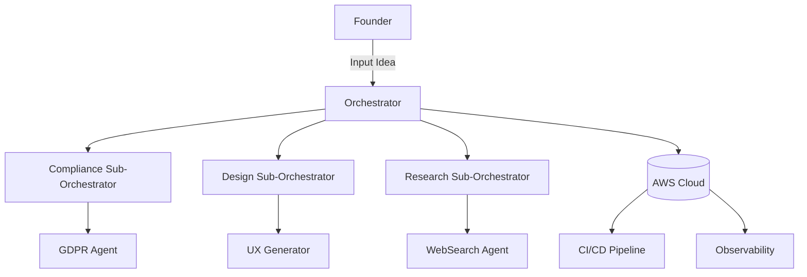
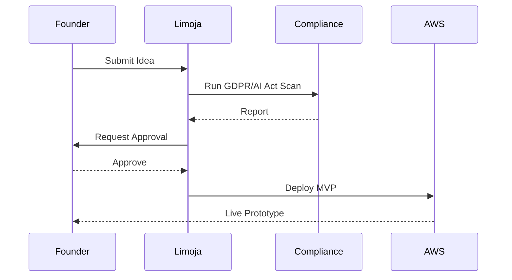

# Limoja Venture Copilot – Comprehensive Project Playbook

---
## 1. Executive Summary

Limoja is an **agentic venture-building copilot** designed to transform the way startups are created. 
It addresses a central problem: most startups fail due to lack of resources, lack of compliance awareness, poor product-market fit, and the overwhelming burden placed on solo founders or small teams. 

### The Vision
Limoja provides **end-to-end venture orchestration**, guiding founders from the moment they have an idea to the point where they have a live, compliant, growth-ready business. Its **AI-driven orchestration engine** integrates planning, research, execution, and compliance checks in one unified system.

### Day in the Life of a Founder with Limoja
Imagine a solo biotech entrepreneur in Oxford with an idea for a SaaS-enabled digital pathology platform. Normally, they would need:  
- Market validation consultants.  
- A product designer.  
- Software developers.  
- Regulatory advisors.  
- A fundraising team.  

With Limoja, the founder simply inputs their **idea + constraints**. The system:  
1. Validates the idea against clinical trials data, PubMed, and industry reports.  
2. Produces a competitive landscape and market sizing.  
3. Generates UX workflows and MVP scope.  
4. Deploys the first cloud prototype to AWS.  
5. Checks for GDPR/AI Act compliance.  
6. Prepares a growth plan with suggested experiments.  

This **compression of work**—from months of human labor to days of orchestrated agent execution—demonstrates Limoja’s power.

### Market Positioning
- **Not a tool**: Unlike Notion AI or ChatGPT plugins, Limoja doesn’t stop at content generation.  
- **Not an accelerator**: Unlike Y Combinator, Limoja scales infinitely without requiring equity.  
- **Not a consulting firm**: Limoja automates execution instead of charging hourly fees.  

It is **the first truly agentic venture copilot**.

---
## 2. Background & Rationale

### 2.1 Startup Bottlenecks
- **90% of startups fail** (CB Insights).  
- Top reasons: no market need, lack of cash, not the right team, regulatory hurdles.  
- Compliance in biotech and medtech is especially costly—requiring regulatory approval before revenue.  

### 2.2 Accelerators & Venture Studios
- Y Combinator, Techstars, IndieBio: strong networks, but limited slots and equity-heavy.  
- Venture studios: resource intensive; typically build 2–3 companies/year.  
- None scale globally without human bottlenecks.  

### 2.3 Rise of Agentic AI
Breakthroughs in agent frameworks (LangGraph, CrewAI, MetaGPT, DeepResearchAgent) show that **multi-agent collaboration and task orchestration** can replace human teams for many workflows.  
However, these systems lack:  
- End-to-end integration.  
- Compliance awareness.  
- Focus on venture building.  

### 2.4 The Gap
Entrepreneurs need a system that is:  
- Always available.  
- Domain-aware.  
- Capable of execution, not just ideation.  
- Scalable across industries.  

Limoja is built to fill this gap.

---
## 3. Concept & Value Proposition

### 3.1 Core Capabilities
- **Orchestration of the six venture stages.**  
- **Hybrid reasoning stack** for reliable decision making.  
- **Integrated compliance** modules (GDPR, UK/EU AI Act).  
- **Cloud-native deployment** to AWS.  

### 3.2 Founder Personas
- **Biotech Founder**: Needs compliance, trial data, and regulatory pathways.  
- **AI SaaS Builder**: Needs quick product-market fit testing and MVP launch.  
- **Medtech Innovator**: Needs clinical validation, regulatory approval pathways.  

### 3.3 Competitive Landscape
| Tool/Model | Focus | Limitation | Limoja Advantage |
|------------|-------|------------|------------------|
| Notion AI | Productivity | Not end-to-end | Full venture orchestration |
| ChatGPT plugins | Single-task automation | Not integrated | Multi-agent, multi-stage orchestration |
| Y Combinator | Accelerator | Equity, selective | Scalable, non-equity |
| Venture Studios | Build companies | Human bottlenecks | Infinite scalability via agents |

---
## 4. System Architecture

### 4.1 Six Stages
1. Ideation & Validation  
2. Product Definition & Design  
3. Development & Implementation  
4. Testing & QA  
5. Deployment & Launch  
6. Growth & Iteration  

### 4.2 Reasoning Stack Explained
- **PS+ (Plan→Execute with Replanning)**: Adaptive planning ensures resilience.  
- **DecomP (Modular Specialists)**: Break down tasks into domain-specific agents.  
- **GoT (Graph-of-Thoughts)**: Multiple reasoning paths reconciled for robustness.  
- **PoT (Program-of-Thoughts)**: Automatic code generation and execution.  
- **SC-CoT (Self-Consistent CoT)**: Consensus among multiple reasoning runs.  

### 4.3 Agent Integration
Limoja unifies:  
- **MetaGPT**: Planner, Architect, Engineer roles.  
- **DeepResearchAgent**: Researcher, WebSearch roles.  
- Under a **typed adapter interface** for cross-compatibility.  

### 4.4 Orchestration Layers
- **Orchestrators** → Control entire stages.  
- **Sub-Orchestrators** → Specific processes (compliance, design).  
- **Utility Agents** → Atomic tasks (scraping, coding).  

### 4.5 Deployment Diagram (Mermaid)


---
## 5. UX & Workflow Design

### 5.1 Human-Agent Interaction
- Entrepreneurs set goals.  
- Limoja decomposes into flows.  
- Approvals required at compliance gates.  

### 5.2 Example Workflow (Mermaid)


### 5.3 Escalation Loops
- Compliance conflicts → SME required.  
- Technical failures → fallback to alternate reasoning path.  

---
## 6. Agentic Execution Plans & Prompts

### 6.1 Strategy Picker Prompt (excerpt)
```
ROLE: Pre-Reasoning Strategy Picker
TASK: Analyze context/task and select reasoning methods
OPTIONS: {CoT, SC-CoT, LtM, PS+, ToT, GoT, H-CoT, HGOT, DecomP, PoT, MAX-SAT}
OUTPUT: Final working prompt with explicit steps
```

### 6.2 Agentic Execution Plan Prompt (excerpt)
```
ROLE: Agentic Process Decomposer
TASK: Convert process into hierarchical execution with orchestrators, sub-orchestrators, and utility agents
OUTPUT: Concise JSON of agent briefs, with research protocols for missing tools
```

### 6.3 Super Agentic Prompt
Generates all outputs end-to-end: workflows, prompts, JSONs, execution flows.

### 6.4 Example JSON
```json
{
  "stage": "Testing",
  "orchestrator": "QA_Orchestrator",
  "sub_orchestrators": [
    "Unit_Testing",
    "Compliance_Checks"
  ],
  "utility_agents": [
    "Test_Generator",
    "Bug_Fixer"
  ]
}
```

---
## 7. Deliverables to Date

- Full **repo structure** with `src/agents`, `src/main_api`, infra configs.  
- **Workflow packages** for all six stages.  
- **Execution JSONs** mapping processes.  
- **Frontend scaffolding** with React/Next.js.  
- **Super Agentic Prompt** created.  
- **Markdown archive export** of repo.  

---
## 8. Latest Stage & Progress

- **Frontend Website** scaffolding built.  
- **Orchestration plan** defined with agents mapped.  
- **JSON execution processes** built and visualized.  
- **Prompts consolidated**.  
- Pending: AWS MVP deployment.  

---
## 9. Roadmap & Next Steps

### 9.1 Week-by-Week
- Week 1–2: IaC setup, CI/CD.  
- Week 3–4: Backend with RBAC + task-graph runner.  
- Week 5–6: Frontend integration + test cycle.  
- Week 7–8: Observability, compliance modules.  
- Week 9–10: Live MVP launch.  

### 9.2 Growth Plan
- Add analytics dashboards.  
- Enable pivot/scale decisions.  
- Community integrations.  

### 9.3 Expansion
- Add agents for fundraising, finance, legal.  
- Expand to fintech, retail, energy.  

---
## 10. Appendices

### A. Prompts (Full Text)
- Strategy Picker  
- Agentic Execution Plan  
- Super Agentic  
- Research Ops Orchestrator  

### B. Repo Structure (Annotated)
```
ai-venture-copilot/
├── src/
│   ├── agents/         # Core agent definitions
│   ├── main_api/       # API endpoints
│   └── ...
├── Dockerfile          # Container build
├── docker-compose.yml  # Local orchestration
├── requirements.txt    # Dependencies
└── README.md
```

### C. Compliance Checklist (Excerpt)
- GDPR: Data minimization, explicit consent.  
- EU AI Act: Risk classification, human-in-the-loop checks.  

### D. References
- MetaGPT (FoundationAgents)  
- DeepResearchAgent (SkyworkAI)  
- Pearl, Bareinboim on causal inference  
- EU AI Act, GDPR guidelines  

---
# End of Document
